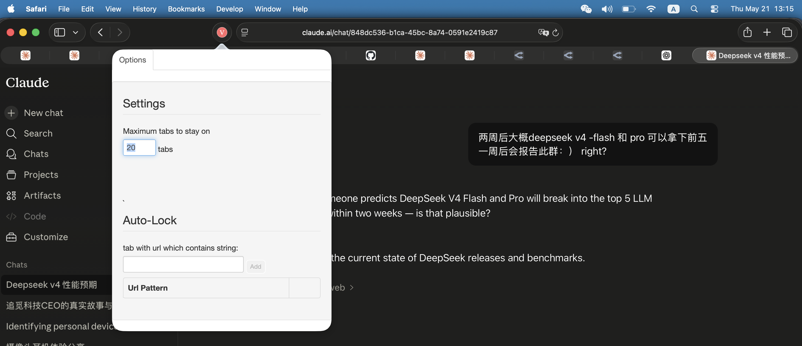

# tab-killer

Automatically close the oldest tabs when your browser gets cluttered with too many tabs. Say goodbye to a messy browser experience forever!

Now available for both **Chrome** and **Safari**!

🌐 English | [中文](README-CN.md)

> A browser extension for Chrome and Safari that automatically kills the oldest tabs when you have too many open.

---

## Safari



<video src="safari-tab-killer.mp4" controls width="100%"></video>

### Install (macOS only, Xcode required)

This project includes a Safari Web Extension. To build and install:

```bash
cd safari-tab-killer
xcrun safari-web-extension-converter . --macos-only --app-name "TabsKiller"
```

Then open the generated Xcode project, select your development team, build and run (⌘R). The extension will be available in Safari → Preferences → Extensions.

Alternatively, open `safari-tab-killer/TabsKiller.xcodeproj` directly in Xcode, configure signing, and run.

---

## Chrome

### Quick Install

Install from Chrome Web Store:

[](https://chromewebstore.google.com/detail/tabs-killer/hgmdeeoighmhomddlghfjcidkdcpbllf)

### Manual Install

1. Open `chrome://extensions` in Chrome
2. Enable **Developer mode** (top right)
3. Click **Load unpacked** and select the `chrome-tab-killer/` directory


---

## Features

1. Automatically close the oldest tabs when the tab count exceeds a set limit
2. Customize the maximum number of tabs
3. Lock specific URL patterns — pinned tabs matching these rules stay open

---

## Story

I usually open many tabs. So I press Ctrl+W to close them a lot, one at a time. Repeat and repeat. I wanted to write an extension to solve my problem. Then I found "Tab Wrangler" which closes tabs when inactive for x minutes — I learned from it and built one that closes the oldest tabs when you exceed your limit. With URL locking for important tabs. It helps me a lot. Tabs never become too many. Hope you like it too.

— Zhiwei, 2016 ⸱ 2026 Safari edition
